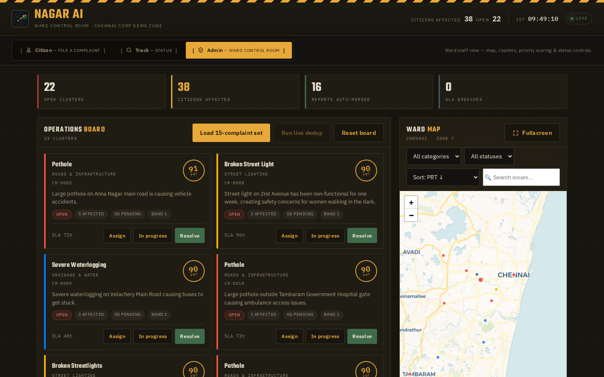
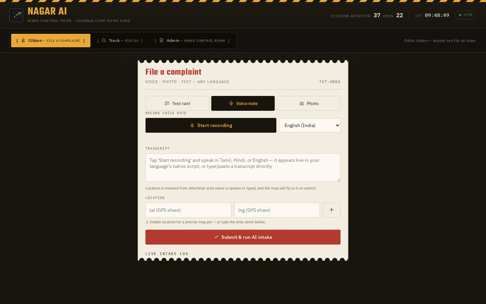
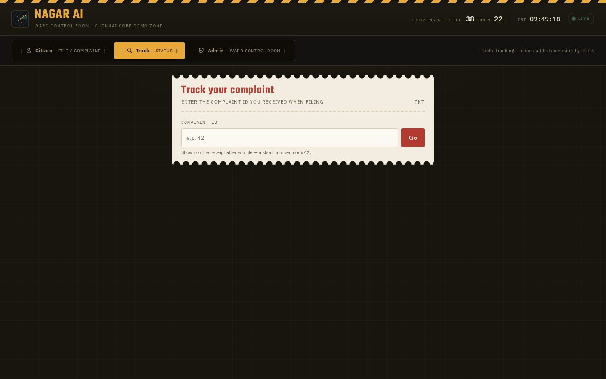
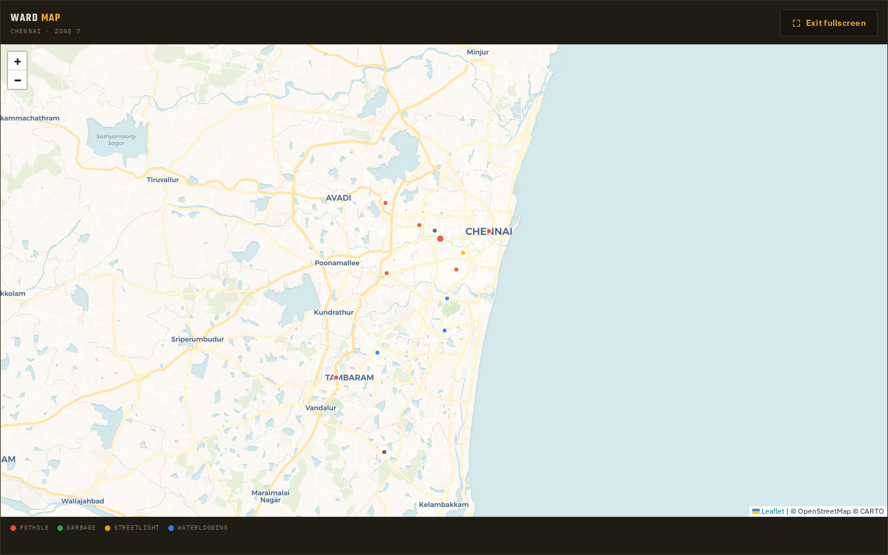
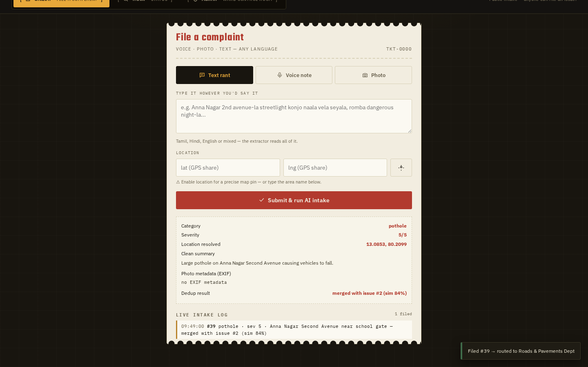

# NagarAI — Civic Complaint Intelligence Engine

AI layer between citizens and civic officials. Citizens complain naturally (voice in 9 Indian
languages, photo, or text — any mix); officials get a **deduplicated, categorised, prioritised, mapped**
queue with explainable ranking.

**Live demo:** `<YOUR_DEMO_URL>` (trusted HTTPS — mic + geolocation work)
**Admin password:** `<ADMIN_PASSWORD>`

> **🔐 Where to change your credentials & URL** — this repo has placeholders only.
> Replace them with your own values before running/deploying:
>
> | Placeholder | Where to change it |
> |---|---|
> | `<YOUR_DEMO_URL>` | docs only (`README.md`, `docs/USAGE.md`, `docs/JUDGES_ONE_PAGER.md`, `DEMO_SCRIPT.md`) |
> | `<YOUR_API_URL>` | `scripts/robustness_battery.py` (`HOST`) and `scripts/run_bench.py` (`--host`) |
> | `<YOUR_SERVER>` / `<YOUR_SERVER_IP>` | `scripts/deploy.sh` (`SERVER=`) |
> | `<YOUR_DASHSCOPE_KEY>` / `<YOUR_OPENROUTER_KEY>` | `backend/.env` (copy from `.env.example`) and `scripts/deploy.sh`. Add multiple DashScope keys as `DASHSCOPE_API_KEYS=k1,k2,k3` for round-robin + auto-retry. |
> | `<ADMIN_PASSWORD>` | `frontend/site/assets/js/app.js` (`ADMIN_PASSWORD`) and `frontend/standalone/index.html` |
>
> The backend `.env` is gitignored — never commit API keys. The admin password is
> client-side for this demo; move it server-side before any real deployment.

## Screenshots

**Admin dashboard** — ward map, cluster cards, PRT stamps:



**Citizen intake** · **Track status** · **Map fullscreen** · **Receipt**:






## Docs
- **📖 [Usage guide](docs/USAGE.md)** — step-by-step for citizens, tracking, and officials
- **🚀 [GitHub upload](docs/GITHUB_UPLOAD.md)** — publish this repo
- **📄 [Tech note](TECH_NOTE.md)** — models, original work, failure modes
- **🎬 [Demo script](DEMO_SCRIPT.md)** — the live judging flow
- **🏛 [Architecture](ARCHITECTURE.md)** — full system design
- **📜 [License](LICENSE)** — MIT

```
Citizen (Ward Control Room UI: voice/photo/text + EXIF GPS)
   │  live Web Speech API voice · qwen-vl vision · qwen3.7-flash extraction · piexif EXIF
   ▼
Structured complaint {category, category_label, category_color, severity, summary, location, photo_meta}
   │  location: GPS share > photo EXIF > vision signage > text geocode > needs-geo pool
   ▼  Dedup: canonicalize-then-embed + geo(60m) + vision → online clustering
Issue with affected_count + per-merge reason
   │
   ▼  Priority: band(S) · P(affected) · T(days) · L(proximity) — formula on screen (PRT)
Ranked map dashboard → resolve → citizen track status
```

## Quick start
```bash
# backend (Python 3.8+, deps in backend/requirements.txt)
cd backend && cp .env.example .env   # fill keys
pip install -r requirements.txt
uvicorn app.main:app --host 0.0.0.0 --port 9999

# the website is frontend/site/ (served by the backend, no build step)
# optional React app in frontend/src (npm install && npm run build)
```
Then open **http://localhost:9999** for local dev. `:9999` is the **internal backend port** —
for a public URL you serve it on 80/443 behind a reverse proxy (no `:9999` in the URL),
which also gives HTTPS so mic + geolocation work. See [ARCHITECTURE.md](ARCHITECTURE.md).

## Key design decisions
- **Canonicalize-then-embed** (dedup): DashScope embeddings are weak on Tamil (validated
  EN↔TA garbage cos=0.24 < cross-category 0.32), so the LLM first produces an English *issue
  fingerprint* which is embedded — Tamil குழி / Hindi गड्ढा / English pothole become identical vectors.
- **Severity-band priority**: `band(S)` master gate; within bands rank = P×T×L. A live-wire with
  2 complaints (~90) always outranks a 40-complaint pothole (~80).
- **Adaptive dedup weights**: when a complaint lacks GPS/photo (or geocode is uninformative),
  weights renormalise so text similarity can still merge — but the 500m geo-fence prevents
  wrong-location merges.
- **Photo EXIF as location**: exact metadata (make/model/time/GPS/altitude/orientation) extracted
  server-side; EXIF GPS is a first-class location source; orientation auto-corrects sideways photos.
- **Robustness**: client-side live transcription streams words as you speak (interim results);
  backend extractor reads Tamil/Hindi/English/mixed directly; geocoder normalises
  "Second Avenue"→"2nd" with retry/backoff; every API call cached.
- **Speed**: `enable_thinking:false` on DashScope chat drops extraction/vision calls from ~14s
  to ~2s (full complaint ~25s → ~4s); live voice is instant (browser-side, no server round-trip).
- **Edge hardening**: empty/silence submissions → friendly 400; NaN/Inf/partial coords sanitized;
  haversine guards non-finite input.

## Features
- **Multimodal intake** — live voice (browser Web Speech API, 9 Indian languages, native script, English default), photo (vision-only classification — no text needed, EXIF GPS + visible signage auto-locate), text (any mix) → one structured complaint
- **Dynamic AI categories** — creates a new category + label + colour + tags when an issue doesn't fit the standard four; ambiguity → `other`, unrelated content → `spam` (quarantined, never clustered). Dropdown lists all live categories.
- **Extensive CSV report** — admin "Download report" button generates a markdown report from the complaints CSV: totals, category/severity/channel/department breakdowns, top tags, and a full **area-segregated** breakdown with per-location issue tables.
- **Dedup** — canonicalize-then-embed + geo + vision; merges duplicates with an explainable "why merged" audit trail
- **Explainable priority (PRT)** — severity-band formula (band·P·T·L), every term visible on cards
- **Tickets** — every complaint has an ID; status chain Open → Assigned → In Progress → Resolved
- **Auto-locate** — browser GPS auto-fills location; photo EXIF GPS as fallback
- **Ward map** — Leaflet, category filters, fullscreen, judging-set demo

## Files
```
backend/app/
  api/routes.py        FastAPI endpoints (intake, /asr, issues, status, search/stats/recent, reset)
  engines/dedup.py     canonicalize-then-embed clustering + SLA routing
  engines/priority.py  severity-band priority (PRT) formula
  services/ai.py       DashScope/OpenRouter clients + multi-key round-robin + CSV cache + webm→wav  services/intake.py   voice/photo/text → structured complaint merge policy (photo-only supported)
  services/geocode.py  Nominatim/Overpass with retry + POI cache
  services/photo_meta.py  exact EXIF extraction (piexif) + orientation fix
  models/store.py      CSV storage (complaints, issues, memberships)
frontend/site/         the Ward Control Room UI (self-hosted fonts/JS, 3 views) — production skin
frontend/standalone/   older single-file UI
frontend/src/          older React app (glassmorphic)
scripts/
  run_bench.py         15-complaint eval harness → purity/coverage/merge/category
  bench_set.py         synthetic judging set (truth-clustered)
  robustness_battery.py  live judging scenarios (noisy voice/sideways/mixed/EXIF GPS)
  priority_workthrough.py  worked examples
  deploy.sh            deploy to server
docs/                  usage guide, GitHub upload, screenshots
TECH_NOTE.md           one-page technical note (models, originality, failure modes)
DEMO_SCRIPT.md         live judging flow
```

## Bench (live on production server)
```
purity 1.0 · coverage 1.0 · merge accuracy 1.0 · category accuracy 1.0
15 complaints → exactly 5 issues; nearby-but-distinct pothole clusters kept separate.
Robustness battery: 5/5 PASS (noisy voice, sideways photo, mixed rant, judge text, EXIF GPS)
```

## Cost
Expected ~$1–5 for the whole event: every API response cached by request hash, cheapest competent
model per task, CPU-only server.
